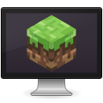

<p align="center">
  
</p>
<h1 align="center">Foreman</h1>
<!-- <p align="center">
  <a href="https://appcenter.elementary.io/com.github.avojak.foreman"></a>
</p> -->

## The simple way to manage your Minecraft server

Get up-and-running with a Minecraft server in moments. Foreman will pull the latest server executable, <!-- establish sensible default settings, -->and launch a new server for you. 

Foreman is intended for those who want to run a Minecraft server on their computer without worrying about digging into the commandline, provisioning a server, or dealing with cloud hosting.

<!-- |  |  |
|------------------------------------------------------------------|------------------------------------------------------------------| -->

## Building and Running

### Flatpak

Flatpak is the preferred method of building Foreman:

```bash
$ flatpak-builder build com.github.avojak.foreman.yml --user --install --force-clean
$ flatpak run --env=G_MESSAGES_DEBUG=com.github.avojak.foreman com.github.avojak.foreman
```

### Updating Translations

When new translatable strings are added, ensure that `po/POTFILES` contains a
reference to the file with the translatable string.

Update the `.pot` file which contains the translatable strings:

```
$ ninja -C build com.github.avojak.foreman-pot
```

Generate translations for the languages listed in the `po/LINGUAS` files:

```
$ ninja -C build com.github.avojak.foreman-update-po
```

---

## Disclaimer

Foreman is not affiliated, associated, authorized, endorsed by, or in any way officially connected with Mojang&copy;, or any of its affiliates.

"Minecraft" is a trademark of Mojang Synergies AB.